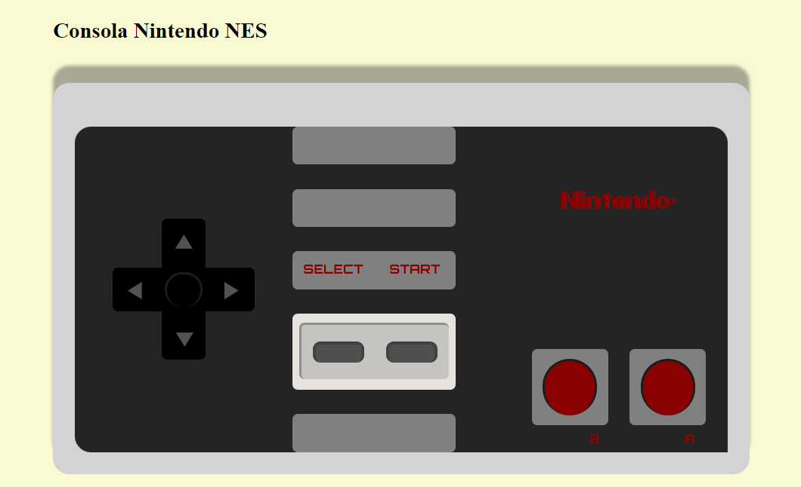

<h1 align="center">
   Nintendo NES Console
</h1>

 

</img>

## About

  
Nintendo Entertainment System: NES Classic Edition, known as Nintendo Classic Mini: Nintendo Entertainment System in Europe and Australia and Nintendo Classic Mini: is a dedicated home video game console by Nintendo, which emulates the Nintendo Entertainment System (NES). It launched on November 10, 2016 in Australia and Japan, and November 11, 2016 in North America and Europe. Aesthetically, the console is a miniature replica of the NES, and it includes a static library of 30 built-in games from the licensed NES library, supporting save states for all of them.
Nintendo Classic Mini: Family Computer (CLV-101) 

